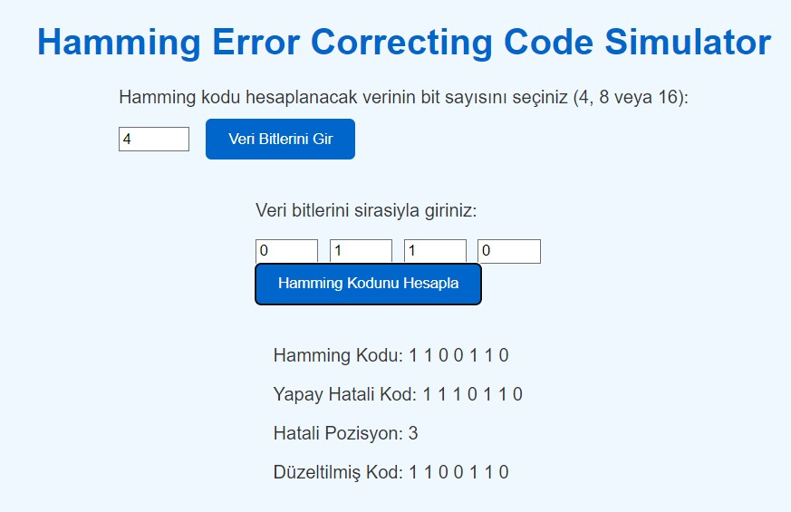
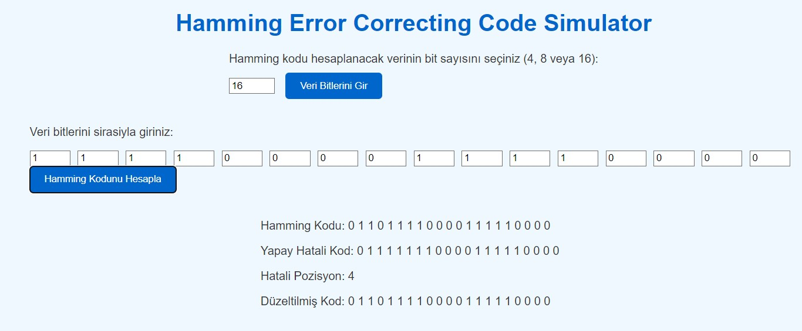

# Hamming Error Correcting Code Simulator

Bu proje, Hamming kodu hesaplamak ve hataları tespit edip düzeltmek için bir web uygulamasıdır. Kullanıcılar, 4, 8 veya 16 bitlik veri girdileri sağlayarak Hamming kodunu hesaplayabilir, yapay olarak oluşturulan hataları görebilir ve bu hataların düzeltilmiş halini inceleyebilirler.

## Özellikler

- **Bit Sayısı Seçimi**: Kullanıcılar 4, 8 veya 16 bitlik veri girişi seçebilir.
- **Hamming Kodu Hesaplama**: Kullanıcı tarafından girilen bitlere göre Hamming kodu hesaplanır.
- **Yapay Hata Oluşturma**: Rastgele bir bit hata olarak değiştirilir ve kullanıcıya gösterilir.
- **Hata Tespiti ve Düzeltme**: Hatalı bit tespit edilir ve düzeltilir.

## Ekran Görüntüleri

